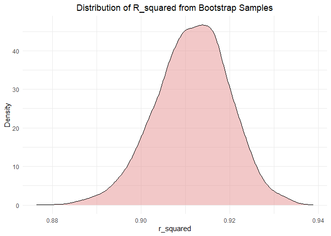
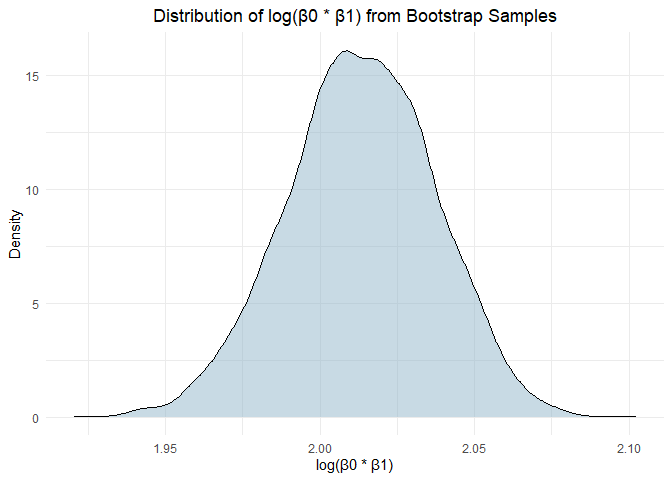
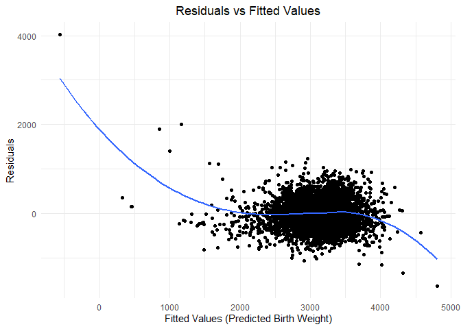
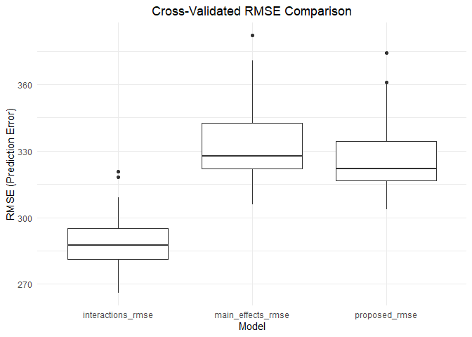

p8105_hw6_sg4489
================

# Problem 1

``` r
library(tidyverse)
library(rsample)
library(broom)
library(ggplot2)
library(purrr)
library(modelr)

set.seed(111)

weather_df = 
  rnoaa::meteo_pull_monitors(
    c("USW00094728"),
    var = c("PRCP", "TMIN", "TMAX"), 
    date_min = "2017-01-01",
    date_max = "2017-12-31") %>%
  mutate(
    name = recode(id, USW00094728 = "CentralPark_NY"),
    tmin = tmin / 10,
    tmax = tmax / 10) %>%
  select(name, id, everything())
```

``` r
# Create 5000 bootstrap samples
bootstrap_samples <- bootstraps(weather_df, times = 5000)

# Define a function to fit the model and extract R-squared and log(beta0 * beta1)
bootstrap_analysis <- function(split) {
  train_data <- analysis(split)  
  model <- lm(tmax ~ tmin, data = train_data) 
  r_squared <- glance(model) %>% pull(r.squared)
  coefficients <- tidy(model)$estimate
  
  # Calculate log(beta0 * beta1)
  log_beta <- log(coefficients[1] * coefficients[2])
  
  return(tibble(r_squared = r_squared, log_beta = log_beta))
}

# Apply the function to each bootstrap sample
bootstrap_results <- bootstrap_samples %>%
  mutate(metrics = map(splits, bootstrap_analysis)) %>%
  unnest(metrics)

# Summarize results
summary_stats <- bootstrap_results %>%
  reframe(
    r_squared_mean = mean(r_squared),
    log_beta_mean = mean(log_beta),
    r_squared_ci = quantile(r_squared, probs = c(0.025, 0.975)),
    log_beta_ci = quantile(log_beta, probs = c(0.025, 0.975))
  )
```

``` r
ggplot(bootstrap_results, aes(x = r_squared)) + 
  geom_density(fill = "#E69191", alpha = 0.5) + 
  labs(
   title = "Distribution of R_squared from Bootstrap Samples",
    x = "r_squared",
    y = "Density"
  ) + 
  theme_minimal() +
  theme(plot.title = element_text(hjust = .5))
```

<!-- -->

The plot shows the distribution of r_squared values from 5000 bootstrap
samples:  
1. Symmetry: The distribution is roughly normal, slightly left-skewed.  
2. Consistency: tightly clustered between 0.88 and 0.94. This suggests
that the fitted model can explain most of the variance in the response
variable in the bootstrap sample.  
3. High Predictive Power: The peak near 0.91 indicates strong
explanatory power.

``` r
ggplot(bootstrap_results, aes(x = log_beta)) + 
  geom_density(fill = "#92B5CA", alpha = 0.5) + 
  labs(
   title = "Distribution of log(β0 * β1) from Bootstrap Samples",
    x = "log(β0 * β1)",
    y = "Density"
  ) + 
  theme_minimal() +
  theme(plot.title = element_text(hjust = .5))
```

<!-- --> The
density curve is approximately symmetric and bell-shaped, suggesting the
distribution of log(β₀ \* β₁) is roughly normal.

The model is consistent and does not exhibit much variation in $\beta_0$
and $\beta_1$ across the bootstrap samples, which implies reliability in
the estimation of this relationship. And the peak is around the mean.

The narrow distribution means that the estimated relationship between
*tmin* and *tmax* is robust and unlikely to vary much with different
data samples.

``` r
lower_ci_rsquare <- round(summary_stats[1, "r_squared_ci"], 3)
upper_ci_rsquare <- round(summary_stats[2, "r_squared_ci"], 3)

lower_ci_logbeta <- round(summary_stats[1, "log_beta_ci"], 3)
upper_ci_logbeta <- round(summary_stats[2, "log_beta_ci"], 3)
```

95% confidence interval for $\hat{r}^2$ is (0.894, 0.927).  
95% confidence interval for $\log(\beta_0 \cdot \beta_1)$ is (1.965,
2.058).

# Problem 2

``` r
# Import and process data
homicides <- read_csv("data/homicide-data.csv", show_col_types = FALSE) %>% 
  mutate(city_state = paste(city, state, sep = ", "), 
         victim_age = ifelse(victim_age == "Unknown", NA, victim_age)
         ) %>% 
  filter(!(city_state %in% c("Dallas, TX", "Phoenix, AZ", "Kansas City, MO", "Tulsa, AL")),  # Omit cities
         victim_race %in% c("White", "Black"),  # Limit races
         !is.na(victim_age)
  ) %>% 
  mutate(victim_age = as.numeric(victim_age))  # Be sure that victim_age is numeric

# Create resolve column, mark resolve(Closed by arrest) as 1
homicides <- homicides %>%
  mutate(resolved = ifelse(disposition %in% c("Closed without arrest", "Open/No arrest"), 0, 1)
  )
```

``` r
baltimore_data <- homicides %>% 
  filter(city_state == "Baltimore, MD") 

# Fit a logistic regression for Baltimore 
baltimore_model <- glm(
  resolved ~ victim_age + victim_sex + victim_race,
  family = binomial,
  data = baltimore_data
)

# Summarize the model results
baltimore_results <- tidy(baltimore_model, exponentiate = TRUE, conf.int = TRUE)

# Extract adjusted odds ratio for male vs female victims
male_vs_female <- baltimore_results %>% 
  filter(term == "victim_sexMale") 

odds_ratio_male_vs_female <- male_vs_female %>% pull(estimate)
conf_low_male_vs_female <- male_vs_female %>% pull(conf.low)
conf_high_male_vs_female <- male_vs_female %>% pull(conf.high)
```

**Adjusted Odds Ratio**: 0.426  
A value of 0.43 means that male victims are 57% less likely to have
their cases resolved.  
**95% Confidence Interval**: (0.324, 0.558)

``` r
# Group data by city and fit glm for each city
city_results <- homicides %>% 
  group_by(city_state) %>% 
  nest() %>% 
  mutate(
    glm_model = map(data, ~ glm(
      resolved ~ victim_age + victim_sex + victim_race,
      family = binomial(link = "logit"),
      data = .x
    )),
    tidy_results = map(glm_model, ~ tidy(.x, exponentiate = TRUE, conf.int = TRUE))
  ) 

# Extract odds ratio for male vs female victims
city_or_results <- city_results %>%
  unnest(tidy_results) %>%
  filter(term == "victim_sexMale") %>%
  select(city_state, estimate, conf.low, conf.high, p.value)

ggplot(city_or_results, aes(x = reorder(city_state, estimate), y = estimate)) + 
  geom_point(size = 2) + 
  geom_errorbar(aes(ymin = conf.low, ymax = conf.high), width = 0.2) +  # Add CIs
  coord_flip() + 
  labs(
    title = "Sex-adjusted Odds Ratios for Solving Homicides by City",
    x = "City",
    y = "Odds Ratio (Male vs Female)"
  ) + 
  theme_minimal() + 
  geom_hline(yintercept = 1, linetype = "dashed", color = "blue")
```

<!-- -->

1.  Cities with OR \< 1(cities at the bottom of the plot):  
    Male victims are less likely to have cases resolved (e.g., New York,
    Baton Rouge).

2.  Cities with OR \> 1:  
    Few cities show higher odds for males(e.g., Albuquerque, Stockton).
    This suggests that male victims are more likely to have their cases
    resolved compared to female victims.  
    However, these ORs often have wide CIs, indicating less certainty in
    the estimates.

3.  Cities with Wide CIs:  
    Cities like Albuquerque, NM, and Stockton, CA, have very wide CIs,
    suggesting high variability or limited data for those locations.  
    Wide CIs make it difficult to draw reliable conclusions about the
    ORs for these cities.

4.  Significance:  
    Cities where the CIs exclude OR = 1 represent statistically
    significant differences(e.g., New York) Other cities with
    overlapping CIs are not statistically significant.

# Problem 3

``` r
birth_data <- read_csv("data/birthweight.csv", show_col_types = FALSE) %>%
  mutate(
    babysex = factor(babysex, labels = c("Male", "Female")),
    frace = factor(frace),
    mrace = factor(mrace),
    malform = factor(malform)
  )
```

``` r
birthweight_model <- lm(bwt ~ blength + gaweeks + delwt + wtgain + babysex, 
                        data = birth_data)

birth_data <- birth_data %>%
  add_predictions(birthweight_model, var = "predicted_bwt") %>%
  add_residuals(birthweight_model, var = "residuals_bwt")

# Plot residuals vs fitted values
ggplot(birth_data, aes(x = predicted_bwt, y = residuals_bwt)) +
  geom_point() +
  geom_smooth(method = "loess", se = FALSE, formula = y ~ x) +
  labs(
    title = "Residuals vs Fitted Values",
    x = "Fitted Values (Predicted Birth Weight)",
    y = "Residuals"
  ) +
  theme_minimal() + 
  theme(plot.title = element_text(hjust = .5))
```

<!-- -->

The plot shows residuals vs. fitted values, indicating:  
1. Non-linearity: The curved LOESS line suggests the model does not
fully capture the relationship between predictors and birth weight.  
2. Heteroscedasticity: Residual variance increases at lower fitted
values, violating regression assumptions.  
3. Outliers: Extreme residuals may influence the model.

``` r
# Proposed model 
model_proposed <- function(data) {
  lm(bwt ~ blength + gaweeks + delwt + wtgain + babysex, data = data)
}

# Length at Birth and Gestational Age
model_main_effects <- function(data) {
  lm(bwt ~ blength + gaweeks, data = data)
}

# Head Circumference, Length, Sex, and All Interactions
model_interactions <- function(data) {
  lm(bwt ~ bhead * blength * babysex, data = data)
}
```

``` r
# Generate 100 Monte Carlo cross-validation splits
cv_splits <- crossv_mc(birth_data, n = 100)

calculate_rmse <- function(model, test_data) {
  predicted <- predict(model, newdata = test_data)
  sqrt(mean((test_data$bwt - predicted)^2))
}

# Fit each model to the training data and calculate RMSE on the test data
cv_results <- cv_splits %>%
  mutate(
    proposed_rmse = map2_dbl(train, test, ~ calculate_rmse(model_proposed(.x), as.data.frame(.y))),
    main_effects_rmse = map2_dbl(train, test, ~ calculate_rmse(model_main_effects(.x), as.data.frame(.y))),
    interactions_rmse = map2_dbl(train, test, ~ calculate_rmse(model_interactions(.x), as.data.frame(.y)))
  ) 

# Calculate the mean RMSE for each model to compare their prediction performance.
cv_summary <- cv_results %>%
  summarize(
    mean_proposed_rmse = mean(proposed_rmse),
    mean_main_effects_rmse = mean(main_effects_rmse),
    mean_interactions_rmse = mean(interactions_rmse)
  )

# Create a boxplot to compare RMSE distributions
cv_results_long <- cv_results %>%
  pivot_longer(
    cols = c(proposed_rmse, main_effects_rmse, interactions_rmse),
    names_to = "model",
    values_to = "rmse"
  )

ggplot(cv_results_long, aes(x = model, y = rmse)) +
  geom_boxplot() +
  labs(
    title = "Cross-Validated RMSE Comparison",
    x = "Model",
    y = "RMSE (Prediction Error)"
  ) + 
  theme_minimal() + 
  theme(plot.title = element_text(hjust = 0.5))
```

<!-- -->

The interactions model is the best in terms of both accuracy (lower
RMSE) and consistency (narrow IQR).  
The proposed model is a good middle ground, balancing complexity and
performance.  
The main effects model is the least effective, with higher RMSE and
variability.
